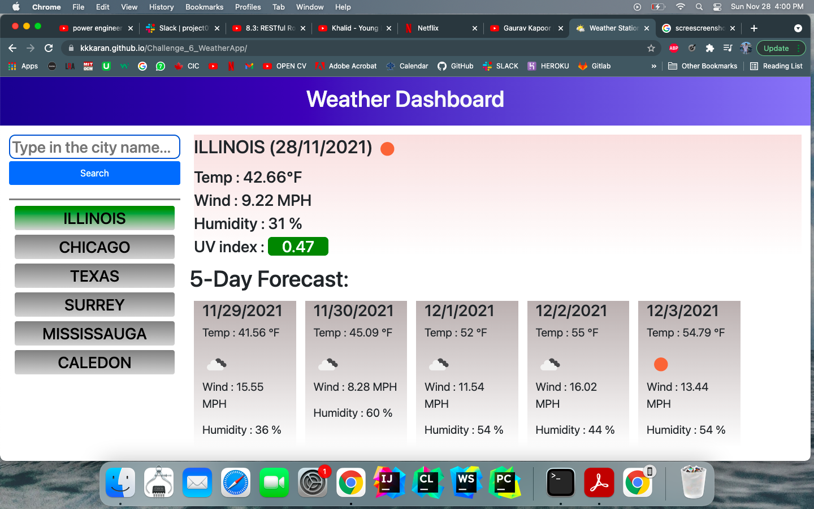

# Challenge_6_WeatherApp:-
# In this app, user types in the city name and the api call displays the current day weather and the 5-day forecast of the city. The city name is displayed to the left of the screen.
# The app stores the cities in local storage and on reload displays the weather of the most recent city searched. Also, it keeps at the most 6 cities in storage and keeps popping out the least recent city searched.
# This app is full responsive and adjusts accordingly.

